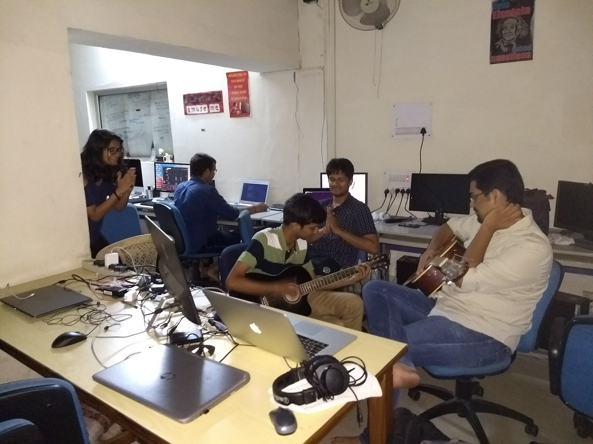

# Sri Sri Parampujya Mahatma Pranjal Tale Ji

This is a glimpse into the life of the one true Lord, our very own _Sri Sri Parampujya Mahatma Pranjal Tale Ji_.

## Covfefe

> Blessed are ye if ye drinketh **covfefe**, the elixir that grants eternal productivity and not tea, the beverage of the devil that causes digestive problems.

Our Lord loves coffee and blesses those who consume it, the colder the better. He used to be an ardent evangelist of _doodh patti_, an alternative implementation of tea, which contains more milk and less tea but has now found that the true path to divinity is through coffee.

One day in the company of God Bedi and Goddess Goyal, our overly-humble tea-loving Lord found enlightenment in the form of coffee at the canteen at Govind Bhawan, a revered place of pilgrimage for Taleists these days. He has never looked back since that day. He is now an avid coffee fanatic and has frequented Café Coffee Day almost every day.

It was later discovered that the Lord has been actively consuming tea and is now _bi-curious_ between tea and coffee. This is good news for tea-lovers as they can now take the oath of allegiance to Lord Tale without fear of negative consequences.

## Guitar skillz

> "Guitar is so cool", said the Lord and it was so. The Lord then yelled **his longest yeah boy ever**.

There is a reason all the bois learn to play the guitar in college. Thanks to a prophecy made by our Lord after strumming one tune on a guitar, the guitar is now considered a tool among n00b college students to look cool among the ladies. They are blissfully unaware that no one can pull off the guitar ploy like our one true Lord.

_This is our Lord showing off his guitar skillz to the God of ML, Anushrut (looking visibly stunned), in the temple-lab of IMG._

One can notice the god of SSH(D), Ankush, and the demigod of terrible jokes, Rhea, seeking his blessings. On closer inspection, Rhea appears to be aware of the photographer and has failed to appear candid. In the background, Debashish, the god of anime, works on with zero chill.

_So many gods in IMG, eh?_

Meanwhile outside the computer center, birds, frogs, dogs and cows from the nearby village have gathered to tune in to the music from the lotus hands of the Lord.

## Summer of Haskell

> "I didn't work hard for the Google Summer of Code", said the Lord, "because if I had **accidentally succeeded**, I wouldn't be able to focus on the Summer of Haskell."
>
> Blessed are ye if ye believe in yourself and consider yourself capable of accidentally qualifying one of the toughest entrance processes in the world.

It was a cold winter. The Lord and one of His many many disciples, Dhruv of house Bhanushali, first of his name, were working in the temple-lab of IMG. Dhruv was obviously struggling to make his first PR into Sympy whereas the Lord who beautifully balances his academics in Applied Mathematics with development was breezing through the code and easily sending PRs.

Finally the Lord learnt of Haskell, a language shrouded in relative obscurity, and brought to light another summer activity manifold superior to GSoC. Although the official name acronymizes to SoH, the Lord wished it to be named HSoC and it was so. The Lord went on to take huge leaps for mankind in the fields of Haskell, functional programming and make it into HSoC. Now the Lord is rich a.f. and very pleased with himself.

## Code editor

> Blessed are ye if ye use **Vim** for the Lord himself uses the same. Blessed are ye if ye use **Atom** for the Lord himself uses the same. Unfortunately, if ye use an IDE like those by JetBrains (WebStorm or PyCharm or IntelliJ), there is no place for thee in the heaven promised by the Lord.

The Lord was a devout Vim advocate in the early days and ferociously hated on all the people who used IDEs, especially Dhruv, of house Bhanushali, who preferred PyCharm to Vim.

Eventually Summer of Haskell led to our Lord trying out and falling in love with Atom. The Lord is now open to people who use both Vim and Atom. He still hates Sublime Text users and people who use Emacs should refrain from coming in front of the Lord, lest he _shoot forth the lasers from his eyeballs_.
